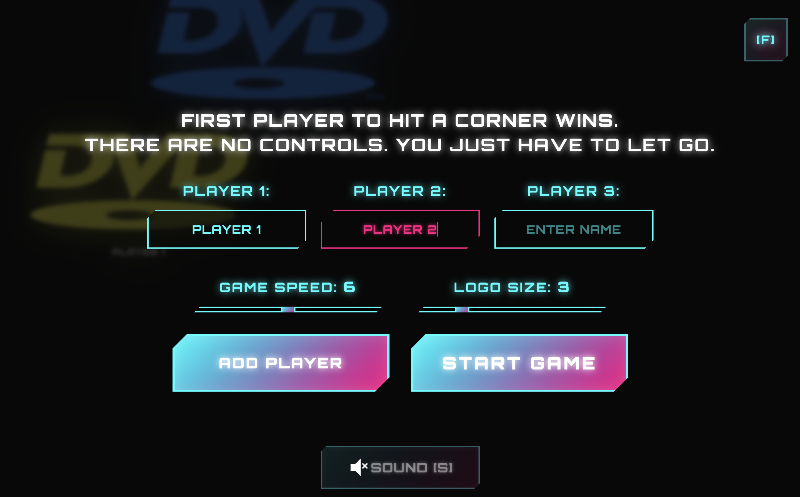

# DVD Screensaver Game

A neon-soaked browser game inspired by the classic DVD screensaver. Compete to see whose logo nails a screen corner first!

## Features
- **Solo or Multiplayer:** Play alone or with up to 12 friends, each with a custom name and color-coded logo.
- **Bouncing DVD Logos:** Every player gets their own animated logo—complete with their name.
- **Corner Hit Showdown:** First logo to hit any corner wins the round.
- **Live Logo Preview:** See your logo bounce around as you type your name.
- **Custom Game Settings:**
  - **Speed:** Crank it up or slow it down (1-5).
  - **Logo Size:** Make your logo huge or keep it classic (1-5).
- **Neon Arcade UI:** Flashy, animated buttons and overlays with glowing effects.
- **Fullscreen Mode:** Go immersive with 'F'.
- **Sound Effects:** Satisfying bounce sounds powered by the Web Audio API.
- **Victory Overlay:** Animated winner screen with stats and a replay button.

## How to Play
1. Enter at least one player name.
2. (Optional) Add more players (up to 12).
3. Tweak speed and logo size if you want.
4. Hit **Start Game**.
5. Watch the logos bounce—first to a corner wins!
6. Use **Play Again** to restart, or **Stop Game** to go back.

## Controls
- **'F' key:** Toggle fullscreen.
- **Add Player:** Add another player (up to 12).
- **Start Game:** Begin the challenge.
- **Stop Game:** End the round and return to setup.
- **Play Again:** Rematch after a win.

## Under the Hood
- **Modular files:** HTML, CSS, and JS are split for easy editing.
- **No dependencies:** 100% pure HTML, CSS, and JavaScript.
- **Responsive:** Looks great on any screen or in fullscreen.
- **Modern CSS:** Gradients, variables, and custom animations for that retro-future vibe.
- **Smooth Animation:** Uses `requestAnimationFrame` for buttery movement.
- **Audio:** Web Audio API for crisp bounce sounds.

## Customization
- **Player Colors:** Add more in the `playerColors` array in the script.
- **Logo SVG:** The DVD logo is inline SVG—easy to tweak for your own style.

## License
MIT License. Free to use and modify.

## Agentic disclaimer

Vibe coded with Claude 4 Sonet, GPT 4.1, codex.
